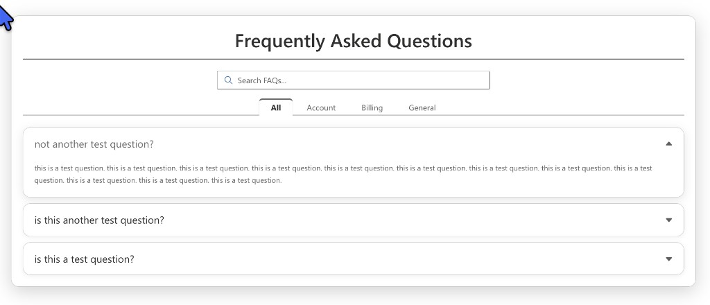
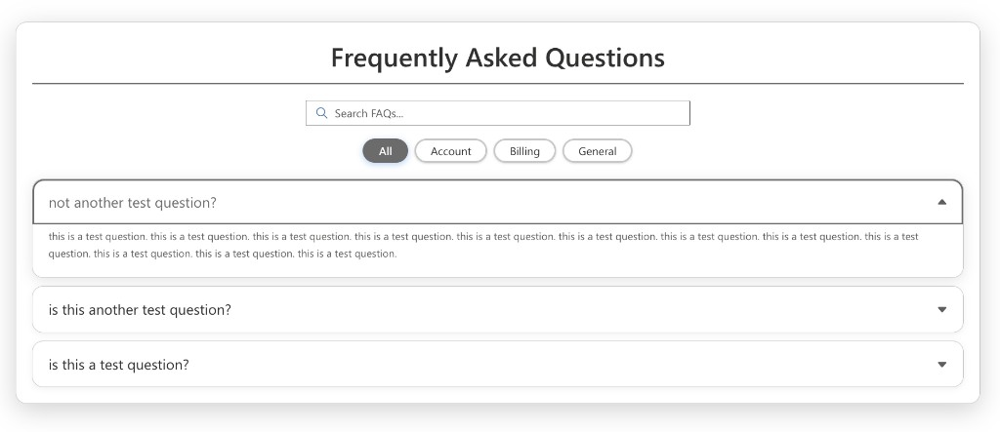
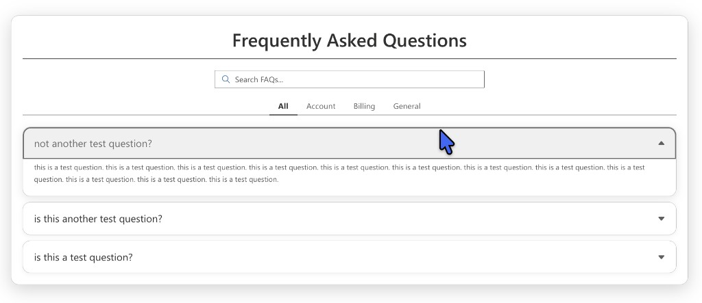
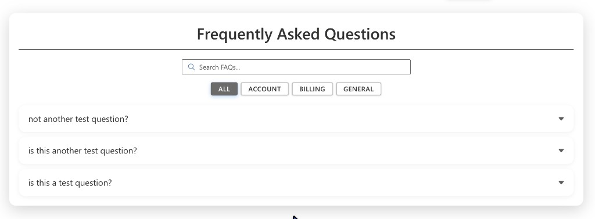
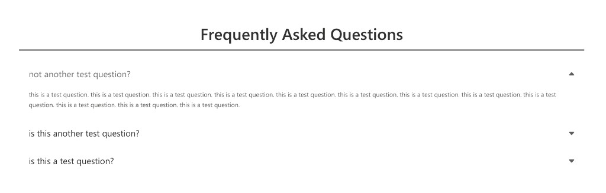
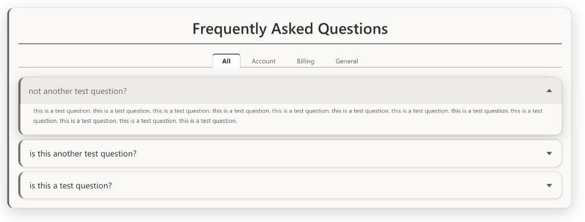
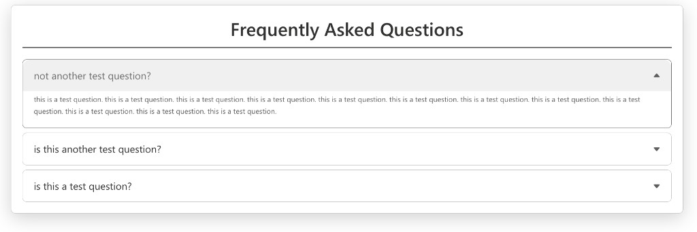
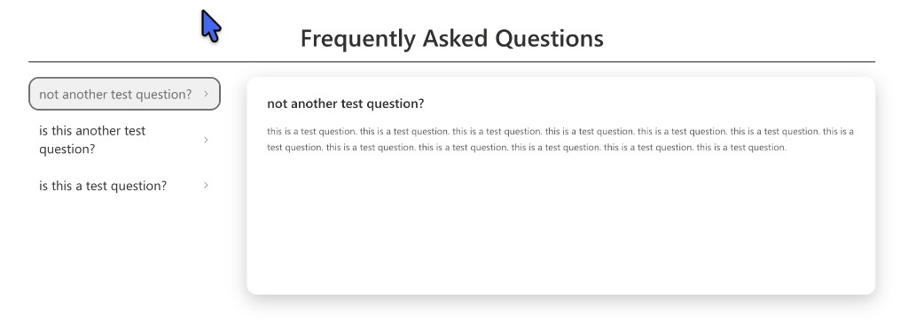

# FAQ - Accordion

A production-ready SharePoint Framework (SPFx) web part that displays frequently asked questions in a modern, accessible accordion layout. Data is pulled from a SharePoint list that is auto-provisioned on first use.

**Publisher:** JScott  
**Version:** 1.1.4  
**Platform:** SharePoint Online (SPFx)

---

## Features

- **Auto-provisioning** — creates the backing SharePoint list automatically on first load
- **4 layout styles** — Minimal, Pill/Panel, Card Stack, Left Nav + Detail Card
- **4 category filter styles** — Tabs, Pills, Underline, Chips
- **Category color coding** — assign custom hex colors per category; question text, borders, and highlights all follow the category color
- **Live search** — filter by question title or question + answer, with configurable placement and alignment
- **Single / multi expand** — control whether one or multiple items can be open at once
- **Full accessibility** — keyboard navigation, `aria-expanded`, `role="button"`, `role="tab"`, `aria-selected`
- **SharePoint theming** — respects light/dark themes; accent color overridable via hex
- **Rich property pane** — collapsible sections covering data source, style, typography, categories, appearance, and advanced options

---

## Screenshots

### Category Filter Styles

| Tabs | Pills |
|------|-------|
|  |  |

| Underline | Chips |
|-----------|-------|
|  |  |

**Tabs** — raised box tabs with a colored top accent bar on the selected item. The selected tab visually "opens" into the content below by removing its bottom border.

**Pills** — rounded pill buttons with a solid fill on selection. Unselected pills show the category color as a border and text tint.

**Underline** — minimal text-only style. A colored bottom border line marks the selected category. No background fill.

**Chips** — compact uppercase rectangular chips with a solid fill on selection. Ideal for dense category lists.

---

### Layout Styles

#### Minimal (Default)



Clean accordion rows separated by thin dividers. No card backgrounds. Best for simple, content-focused FAQ pages.

---

#### Pill / Panel Accordion



Each item is a fully rounded panel with a surface background and a persistent accent-colored border. The header receives a light tint on hover and when expanded, giving a clear visual signal of which item is active. When color coding is on, the border and tint follow the item's category color.

---

#### Card Stack



Each item is a fully elevated card with:
- A **4px left accent bar** in the accent color (or category color when color coding is on)
- A **drop shadow** that lifts on hover and expands further when the item is open
- A subtle grey header tint when expanded
- Extra left padding on the answer to align with the accent bar

Best for layouts where each FAQ item should feel like an independent, distinct element.

---

#### Left Nav + Detail Card



Questions are listed in a compact left-side navigation panel. Clicking a question displays its full answer in a large detail card on the right. The selected question is highlighted in the nav list, and the detail card border changes to the category color when color coding is on.

---

## SharePoint List Schema

The web part auto-creates a list named **FAQ Accordion** with the following columns:

| Column | Type | Notes |
|--------|------|-------|
| Title | Single line of text | The question text |
| Answer | Multiple lines (rich text) | The answer body |
| Category | Choice | Used for category filtering |
| SortOrder | Number | Controls display order |
| IsActive | Yes/No | Hide items without deleting |
| ExpandedByDefault | Yes/No | Item opens on page load |

---

## Property Pane Reference

### Data Source
| Setting | Description |
|---------|-------------|
| Select List | Choose the SharePoint list to pull FAQ items from |
| Create / Reconnect List | Auto-provisions the list and required columns |

### Accordion Style
| Setting | Description |
|---------|-------------|
| Layout Style | Minimal, Pill/Panel, Card Stack, Left Nav + Detail Card |
| Arrow Position | Left or Right |
| Icon Style | Chevron, Plus/Minus, Arrow, Caret |
| Expand Mode | Single (one open at a time) or Multi |
| Expand First Item | Auto-open the first item on load |
| Show Dividers | Toggle divider lines between items |
| Animation | Smooth expand/collapse transition |

### Title & Text
| Setting | Description |
|---------|-------------|
| Show Title | Toggle the web part title |
| Title Text | Custom title string |
| Title Alignment | Left, Center, Right |
| Title Font Size | 14–36 px slider |
| Question Font Size | 12–24 px slider |
| Question Text Style | Normal, Bold, Italic, Bold + Italic |
| Answer Font Size | 11–20 px slider |
| Category Font Size | 11–18 px slider |

### Categories & Search
| Setting | Description |
|---------|-------------|
| Show Categories | Toggle the category filter bar |
| Category Style | Tabs, Pills, Underline, Chips |
| Category Alignment | Left, Center, Right |
| Show "All" Option | Adds an "All" button (always grey when color coding is on) |
| Color-Code Categories | Assign colors per category; affects question text, borders, and highlights |
| Category Color Slots | Up to 10 hex codes, one per category |
| Show Search Bar | Toggle live search |
| Search Bar Placement | Above Categories, Below Categories, Full Width |
| Search Bar Alignment | Left, Center, Right |
| Search Placeholder | Custom placeholder text |
| Search Scope | Question only, or Question + Answer |

### Appearance
| Setting | Description |
|---------|-------------|
| Accent Color | Override the SharePoint theme blue with a custom hex color |
| Title / Question / Answer / Icon / Border Color | Per-element hex overrides |
| Border Thickness | 0 (none) to 4 px |
| Border Darkness | Slider controlling border opacity (0–100) |
| Border Radius | 0–16 px |
| Spacing Density | Compact, Normal, Spacious |
| Shadow Intensity | None, Light, Medium, Heavy (card styles) |

### Advanced
| Setting | Description |
|---------|-------------|
| Sort Field | SortOrder (default) or Title |
| Sort Direction | Ascending or Descending |
| Show Only Active | Filter to IsActive = Yes |
| Max Items | Cap the number of items returned |
| Empty State Text | Message shown when no items match |
| Loading Text | Message shown while data loads |

---

## Installation

1. Download `faq-accordion.sppkg` from the `sharepoint/solution/` folder
2. Upload to your **SharePoint App Catalog** (tenant or site collection)
3. Deploy / trust the app
4. Add the **FAQ - Accordion** web part to any modern SharePoint page
5. Open the property pane and select or create a list — the web part will auto-provision the list and columns on first use

---

## Permissions Required

- **Read** access to the target SharePoint list (all users viewing the page)
- **Contribute** or higher on the site to allow the web part to auto-create the list on first load (site owner / admin recommended for initial setup)

---

## Development

```bash
# Install dependencies
npm install

# Start local workbench
npx gulp serve

# Production build
npx gulp bundle --ship
npx gulp package-solution --ship
```

Built with SPFx, React, TypeScript, Fluent UI, PnPjs, and SCSS Modules.
