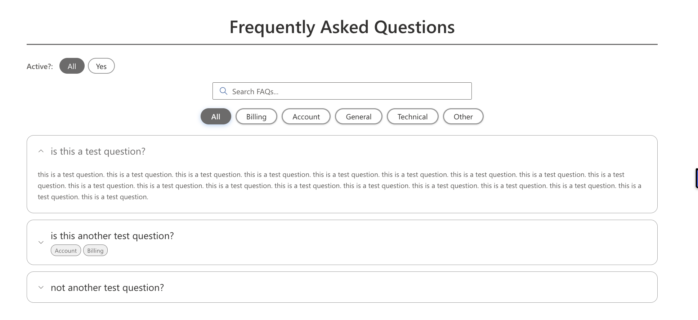

# FAQ - Accordion

A production-ready SharePoint Framework (SPFx) web part for displaying FAQs in a modern, accessible accordion connected to a SharePoint list.

**Publisher:** JScott  
**Current Release:** 1.9.0.0  
**Platform:** SharePoint Online (SPFx)

---

## Features

- Auto-provisions and validates a SharePoint list on first load
- Four layout styles: Minimal Classic, Pill/Panel, Card Stack, Left Nav + Detail Card
- Category filtering with four styles (Tabs, Pills, Underline, Chips)
- Multi-category support (items can appear under multiple category filters)
- Category visibility + manual ordering controls in property pane
- Optional list view scoping (show only items matching a selected SharePoint view)
- Optional secondary filter bar driven by Choice/MultiChoice/Yes-No columns
- Search bar controls (placement, alignment, scope)
- Theme-aware styling with optional accent override and category color coding
- Smooth expand/collapse animation (always on)

---

## Newer Capabilities (v1.8+ / v1.9)

- **Secondary Filter Bar** can be turned on and configured from property pane
  - Pick filter column
  - Custom filter bar label
  - Placement: above or below search
  - Alignment: left/center/right
- **List View Selector** in Data Source to apply an existing SharePoint view
- **Category Visibility & Order** section to hide categories and move them up/down
- **Item Gap slider** for space between FAQ items
- **Web Part Padding slider** for outer spacing around content

---

## Screenshot

### Secondary Filter Bar + Categories + Search



---

## SharePoint List Schema

The web part auto-creates a list named **FAQ Accordion** with these columns:

| Column | Type | Notes |
|--------|------|-------|
| Title | Single line of text | Question text |
| Answer | Multiple lines (rich text) | Answer body |
| Category | Choice / MultiChoice | Category filter tags |
| SortOrder | Number | Display order |
| IsActive | Yes/No | Hide items without deleting |
| ExpandedByDefault | Yes/No | Open item by default |

---

## Property Pane Reference

### Data Source

| Setting | Description |
|---------|-------------|
| Select List | Choose the SharePoint list |
| Create / Reconnect List | Ensure list + required columns exist |
| List View (optional) | Scope displayed items using an existing list view |

### Accordion Style

| Setting | Description |
|---------|-------------|
| Layout Style | Minimal, Pill/Panel, Card Stack, Left Nav + Detail Card |
| Arrow Position | Left or right |
| Icon Style | Chevron, Plus/Minus, Arrow, Caret |
| Expand Mode | Single or multi |
| Expand First Item | Open first item by default |
| Space Between Items (px) | Controls item gap |

### Title & Text

| Setting | Description |
|---------|-------------|
| Show Title | Toggle title visibility |
| Title Text | Title string |
| Title Alignment | Left/center/right |
| Title Font Size | 14-36 px |
| Question Font Size | 12-24 px |
| Question Text Style | Normal, bold, italic, bold+italic |
| Answer Font Size | 11-20 px |
| Category Font Size | 11-18 px |

### Categories & Search

| Setting | Description |
|---------|-------------|
| Show Categories | Toggle category bar |
| Category Style | Tabs/Pills/Underline/Chips |
| Category Alignment | Left/center/right |
| Show "All" Option | Adds All button |
| Color-Code Categories | Uses category-specific accent color behavior |
| Category Color Slots | Per-category hex color inputs |
| Show Search Bar | Toggle search |
| Search Bar Placement | Above categories / below categories / full width |
| Search Bar Alignment | Left/center/right |
| Search Scope | Question only or question+answer |

### Secondary Filter Bar

| Setting | Description |
|---------|-------------|
| Show Secondary Filter Bar | Enables user-facing chip filters |
| Refresh Column List | Reload available filterable columns |
| Filter by Column | Select Choice/MultiChoice/Yes-No column |
| Filter Bar Label | Custom label text |
| Placement | Above search or below search |
| Chip Alignment | Left/center/right |

### Category Visibility & Order

| Setting | Description |
|---------|-------------|
| Hide/Show category buttons | Control which categories are visible |
| Move Up / Move Down | Reorder category button display |

### Appearance

| Setting | Description |
|---------|-------------|
| Accent Color | Override theme accent |
| Title/Question/Answer/Icon/Border Color | Optional hex overrides |
| Border Thickness | 0-4 px |
| Border Darkness | 0-100 (0 = transparent) |
| Border Radius | 0-16 px |
| Web Part Padding | 0-40 px outer padding |
| Shadow Intensity | None/light/medium/heavy (card styles) |

### Advanced

| Setting | Description |
|---------|-------------|
| Sort Field | SortOrder or Title |
| Sort Direction | Asc/desc |
| Show Only Active | Only `IsActive = Yes` |
| Max Items | Item cap |
| Empty State Text | Message when no items match |
| Loading Text | Message while data loads |

---

## Installation

1. Build package:
   - `npx gulp bundle --ship`
   - `npx gulp package-solution --ship`
2. Upload `sharepoint/solution/faq-accordion.sppkg` to App Catalog
3. Deploy the app
4. Add **FAQ - Accordion** web part to page
5. Configure list and settings from property pane

---

## Permissions

- **Read** for page viewers on FAQ list
- **Contribute+** recommended for first-time list auto-provisioning

---

## Development

```bash
npm install
npx gulp serve
```
